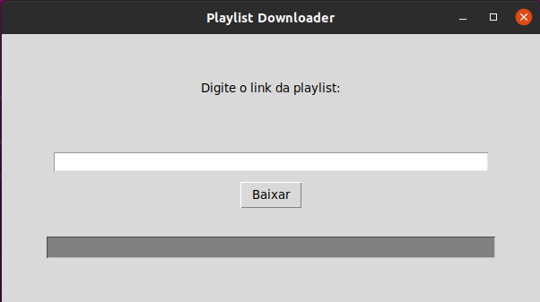
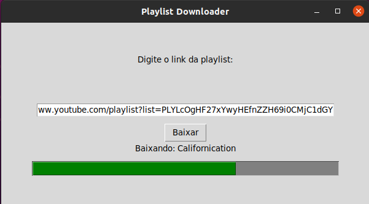
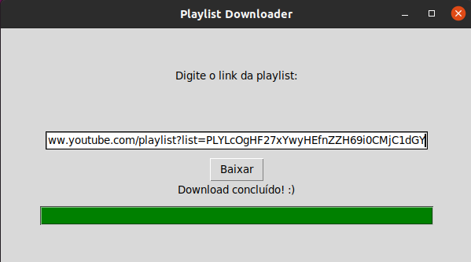
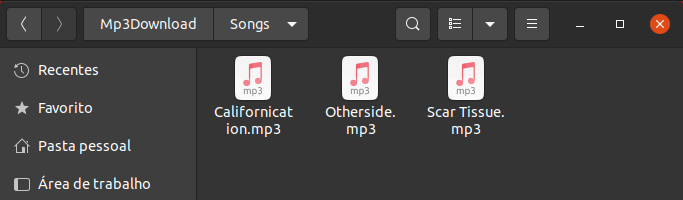

# Playlist Downloader

Este projeto consiste no download de arquivos .mp4 que estejam em uma determinada playlist e na conversão para o formato .mp3

## Instalação de bibliotecas 

```bash
pip install pytube
pip install moviepy
```

## Execução do projeto
```bash
python3 main.py
```

## Visualização da interface 










 



